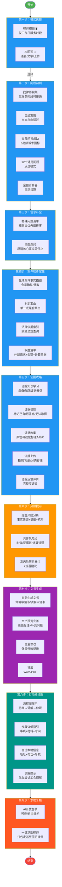

# AI引导式互动求助流程图

```mermaid
flowchart TD
    START([开始]) --> STEP1[/选择模式/]

    subgraph STEP1[第一步：模式选择]
        A1[律师视频 🖥️<br/>仅工作日服务时段]
        A2[AI问答 💬<br/>语音/文字/上传]
    end

    STEP1 -->|选择| STEP2

    subgraph STEP2[第二步：问题初判]
        B1[找律师视频<br/>仅服务时段可接通]
        B2[自述案情<br/>文本自由描述]
        B3[交互问答求助<br/>6高频诉求图标]
        B4[12个通用问题<br/>点选模式]
        B5[金额计算器<br/>自动核算]
    end

    STEP2 --> STEP3

    subgraph STEP3[第三步：信息补全]
        C1[特殊问题清单<br/>按案由优先级排序]
        C2[动态连问<br/>厘清核心事实即停止]
    end

    STEP3 --> STEP4

    subgraph STEP4[第四步：案件初步定性]
        D1[生成案件事实描述<br/>会员确认/修改]
        D2[判定案由<br/>单一或组合案由]
        D3[法律依据索引<br/>跳转法规查询]
        D4[权益清单<br/>仲裁请求+金额+计算依据]
    end

    STEP4 --> STEP5

    subgraph STEP5[第五步：证据攻略]
        E1[证据知识学习<br/>必备/加强证据分类]
        E2[证据梳理<br/>标记已有/可补充/无法取得]
        E3[证据收集<br/>颜色可视化标注A/B/C]
        E4[证据上传<br/>拍照/相册/分类存储]
        E5[证据反馈评价<br/>完整度评级]
    end

    STEP5 --> STEP6

    subgraph STEP6[第六步：风险提示]
        F1[综合风险分析<br/>事实表述+证据+抗辩]
        F2[具体风险点<br/>时效/证据链/计算错误]
        F3[高风险醒目标注<br/>+规避建议]
    end

    STEP6 --> STEP7

    subgraph STEP7[第七步：文书生成]
        G1[自动生成文书<br/>仲裁申请书/调解申请书]
        G2[文书预览完善<br/>高亮标注+补充问题]
        G3[自主修改<br/>保留修改记录]
        G4[导出<br/>Word/PDF]
    end

    STEP7 --> STEP8

    subgraph STEP8[第八步：行动路线图]
        H1[流程图展示<br/>协商→调解→仲裁]
        H2[步骤详细指引<br/>事项+材料+时间]
        H3[宿迁本地信息<br/>地址+电话+导航]
        H4[调解提示<br/>优先尝试工会调解]
    end

    STEP8 --> STEP9

    subgraph STEP9[第九步：求助复核]
        I1[AI开放复核<br/>预设/自由提问]
        I2[一键求助律师<br/>打包发送至值班律师]
    end

    STEP9 --> END([结束])

    style START fill:#4CAF50,color:#fff
    style END fill:#f44336,color:#fff
    style STEP1 fill:#2196F3,color:#fff
    style STEP2 fill:#2196F3,color:#fff
    style STEP3 fill:#2196F3,color:#fff
    style STEP4 fill:#2196F3,color:#fff
    style STEP5 fill:#2196F3,color:#fff
    style STEP6 fill:#FF9800,color:#fff
    style STEP7 fill:#9C27B0,color:#fff
    style STEP8 fill:#009688,color:#fff
    style STEP9 fill:#FF5722,color:#fff
```
